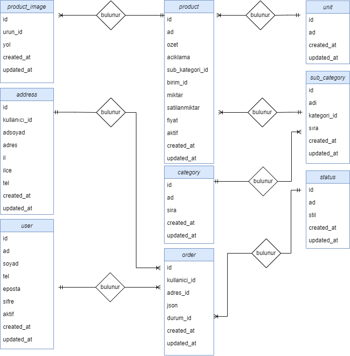

**KOCAELİ ÜNİVERSİTESİ**

**Web Tabanlı Alışveriş Sitesi Geliştirme**

Turan Öz, Ramazan KAPLANER

Bilişim Sistemleri Mühendisliği

Kocaeli Üniversitesi

[181307006@kocaeli.edu.tr](mailto:181307006@kocaeli.edu.tr)

[181307024@kocaeli.edu.tr](mailto:181307024@kocaeli.edu.tr)

# Özet

Bu projenin amacı, kullanıcıların web üzerinden ihtiyaçları doğrultularında alışveriş yapmaları için web tabanlı alışveriş sitesi geliştirmektir. Çalışmanın veri tabanı alt yapısını MYSQL kullanılmış olup web programlama bölümü ise Laravel Framework ile gerçekleştirilmiştir. Projenin sonunda kullanıcıların güvenli ve sorunsuz bir şekilde alışveriş yapmaları sağlanmaktadır.

# Abstract

This study is a web-based shopping site development project that enables customers to shop on the web and mobile in line with their needs. In the designed web-based application, users are provided with safe and trouble-free shopping. The database infrastructure of the study was MYSQL and the web programming part was carried out with Laravel Framework.

# 1.Giriş

İnternet iş yapmayı çok daha kolay ve hızlı hale getiriyor. Çevrimiçi alışverişe veya e-ticarete yönelik dünya çapında hızla büyüyen bir eğilimle insanların iş yapma biçiminde değişikliklere yol açtı. Dünya çapında pek çok insan, kendi ülkelerinde bulamadıkları veya satın almaları mümkün olmayan birçok marka ve şirketten online alışveriş yapmayı ve satın almayı tercih ediyor. Günümüzde, yeni teknolojinin ve internetin de desteğiyle, dünyanın her yerinden insanlar evlerinde oturarak çevrimiçi ürün satın almaya başladılar. Web üzerinden ürün satın almak çok kolay bir iş haline geldi. Yaşlılar, çok yoğun bir yaşam programı olan insanlar ürünü alışveriş sepetine kaydedip daha sonra satın alabilmesi ile müşterilerine oldukça konforlu bir hizmet sunmaktadır.

E-ticarete yönelik Dünya Ticaret Örgütü (WTO), Birleşmiş Milletler Yönetim, Ticaret ve Ulaştırma İşlemlerini Kolaylaştırma Merkezi (CEFACT), Ekonomik iş birliği ve Kalkınma Teşkilatı (OECD), Türkiye Elektronik Ticaret Kurulu (ETİK) gibi kuruluşlar çeşitli tanımlar yapmıştır. Bu tanımlardan yola çıkarak e-ticaret; bilgi, ürün ve hizmetlerin sunum, reklam, sipariş, satış ve pazarlama faaliyetlerinin doğrudan fiziksel bağlantı kurmaya gerek kalmadan internet üzerinden gerçekleştirilmesi olarak tanımlanabilir.

E-ticaret sisteminin alıcılar, satıcılar, üretici, komisyoncular, sigorta ve nakliye şirketleri gibi tarafları bulunmaktadır. Bu taraflar arasında çeşitli şekillerde e-ticaret faaliyetleri gerçekleşmektedir

E-ticaret sayfalarının avantajları ve geleneksel ticarete göre farkları temel alındığında e-ticaret web sayfalarının tasarımının da önem arz ettiği söylenebilir. Web sayfasının ara yüz tasarımının kullanıcılar için daha etkin bir şekilde tasarlanması önemlidir.

# 2. Tanımlama

Proje yönetici ve kullanıcı kısımları olmak üzere iki kısımdan oluşmaktadır.

Yönetici kısmı sistemi kontrol edecek, yönetecek.

Bunlar, ürün bilgisi, adeti, fiyat bilgilerini ekleme, silme güncelleme. Kullanıcıları görüntüleme ve benzeri işlemleri gerçekleştirmek.

Kullanıcı kısmı sisteme kayıt olarak giriş yapacaktır. Ürünleri görüntüleyerek sepetine ekleyecek, sepetten silecek, toplam tutarı görecek ve sipariş verecektir.

1.3 Yönetim paneli

**2.1 Yönetici Sistemi**

Yönetici sistemi, dört kategoride ayrılmıştır. Gösterge panelinde toplam ürün , sipariş ve kullanıcı sayısı listelenmektedir. Ürünler kısmında, ürünleri güncelleme işlemleri yapılır. Sipariş kısmında, siparişlerin durumları kontrol edilir. Müşteri kısmında , siteye kayıtlı olan müşterilerin bilgileri listelenir.

1.1 Ana sayfa

**2.2 Kullanıcı Sistemi**

Kullanıcılar, sipariş verebilmek için siteye giriş yapması gerekir. Giriş yapmak içinde kullanıcının kayıt olması gerekmektedir. Kayıt olduktan sonra kullanıcılar sisteme adres tanımlamaları gerekir adres tanımlamayan kişiler sipariş veremez. Adres tanımladıktan sonra kullanıcılar ödeme yöntemi seçip sipariş verebilirler.

1.2.1 Google Maps API

**2.2.1 Google Maps API**

Sitemizin iletişim sekmesinde harita görüntüleme işlemini gerçekleştirmek için Google Maps API kullandık.

# 3. Yazılım Mimarisi

Bu bölümde kullanılan teknolojilere yer verilmiştir.

**3.1 Laravel ve PhpStorm**

Laravel framework ünü kullanmamızdaki sebepleri şöyle sıralayabiliriz:

-   Dahili kimlik doğrulama ve yetkilendirme sistemi
-   Basitleştirilmiş posta entegrasyon sistemi
-   Yüksek güvenlikli çerçeve
-   Sorunsuz veritabanı geçişi

Gibi sebepler web uygulamamızda Laravel framework ünü kullanmamızda etki etti.

PhpStorm içinde barındırdığı araçlar ve kolay veritabanı bağlantısı gibi sunduğu seçenekler ile birlikte hızlı ve ayakları yere basar bir geliştirme yapmamıza olanak sağladı.

**3.2 MySQL**

MySQL açık kaynaklı bir ilişkisel veritabanı yönetim sistemidir (RDBMS). RDBMS ilişkisel bir modele dayalı veritabanı yaratmak ve yönetmek için kullanılan bir hizmettir.Bizde Sistemimizde bu hizmeti kullandık.

MySQL istemci-sunucu modelli kullanıcı dostu tarayıcı arayüzü ve bazı özel tanımlı özellikleri olması sebebiyle uygulama yapım süresince kolaylıklar sağladı.

**4. Karşılaşılan Sorunlar**

Laravel ile ilgili gerekli youtube dersleri izledikten sonra kendi seçtiğimiz temayı parçalamakta zorlandık. Bu süreçte ilgili forumlarda konu açarak çözümlere ulaştık

# 5. Faydalar

Bu projenin bize kattığı birçok şey var. Karışık gibi görünen problemlerin üstesinden gelmenin ekip halinde çalışarak kolay bir şekilde çözülebileceğini gördük. Proje sürecini en etkili şekilde ve tam verimli halde yönetmeyi tecrübe ettik. Görev paylaşımı yaparak ödev süremizi en aktif şekilde kullandık ayrıca görev paylaşımı sırasında karşılaştığımız sorunları kısa toplantılarla çözmeye çalıştık. Yaptığımız projede birçok teknoloji kullanmamız bakış açımızı arttırdı.

**6. Sözde Kod**

Yalancı kod, herhangi bir programlama diline bağlı kalmadan sözler ile bir programın tasarlanması diyebiliriz. Yalancı kod yazımında

programlama dilinde geçen ifadeler kullanılmadan yazılır. Yalancı kod yazımında mantıksal sırasıyla yapılacak işlemler yazılır. Bu projenin yalancı kodu:

1-Basla

2-Giriş tercihini seç

**3-Yönetici seçildi**

4-Mail ve Şifreyi gir

5- Yönetici sayfası açıl

6-Ürün ekle, düzenle

7-Müşteri düzenle

**3-Kullanıcı seçildi**

4-Ana sayfaya gir

5-Ürün ve adet seç

6-Adet, toplam adetten büyük mü

**7-Evet**

8-Yeterli adet yok

**7-Hayır**

8-Sepete ekle

9-Giriş yapıldı mı

**10-Hayır**

11-Üye ol

**10-Evet**

11-Adres girildi mi

**12-Hayır**

13-Adres gir

**12-Evet**

13-Siparişi tamamla

14-Bitti

# 7.Akış Diyagramı

# 8.Veritabanı Varlık-İlişki Diyagramı

# 

# 

# 

# 

# 9. Kaynakça

[1] <https://laravel.com/docs/9.x/installation>

[2] [https://mahmutbayri.com/laravel-istekle](https://mahmutbayri.com/laravel-istekle%09)

[3] <https://laravel.gen.tr/>

[4] <https://laravel.gen.tr/d/6366-iliskilendirme-sorunum>

[5] <https://laravel.com/docs/9.x/views>

[6] <https://learn2torials.com/a/laravel-view-composers>

[7] <https://vegibit.com/what-is-a-view-composer-in-laravel/>

[8] <https://medium.com/@bvipul/view-composers-in-laravel-1898e4412890>

[9] <https://appdividend.com/2022/01/13/sql-ascii-function/>

[10] <https://blog.quickadminpanel.com/laravel-belongstomany-add-extra-fields-to-pivot-table/>

[11] <https://stackoverflow.com/questions/69342846/error-when-try-to-store-token-firebase-laravel-notification-referenceerror-can>

[12] <https://www.youtube.com/watch?v=ayKMfVt2Sg4>

[13] <https://www.youtube.com/watch?v=juKDXPk7kU4>

[14] <https://laravel.gen.tr/u/turanoz>

<https://laracasts.com/discuss/channels/laravel/how-to-test-why-my-view-composer-isnt-working>

[15] https://vegibit.com/laravel-belongstomany-example/

[16] <https://stackoverflow.com/questions/69457102/laravel-8-define-belongstomany-definition-in-model-factory>

[17] https://www.codegrepper.com/search.php?answer_removed=1&q=belongstomany%20in%20laravel%208

[18] <https://www.itsolutionstuff.com/post/laravel-many-to-many-eloquent-relationship-tutorialexample.html>

[19] <https://medium.com/@afrazahmad090/laravel-many-to-many-relationship-explained-822b554c1973>

[20] https://appdividend.com/2022/01/21/laravel-many-to-many-relationship/

[21] https://laravel.gen.tr/u/turanoz

[22] <https://www.mertbuldur.com/>

[23] <https://phpturkiye.net/php-dersleri>

[24] https://www.mertbuldur.com/hizmet/web-yazilim

[25] <https://stackoverflow.com/questions/34493647/laravel-5-1-barryvdh-laravel-dompdf-pdf-file-download-not-working-properly>

[26] <https://www.youtube.com/watch?v=o-C77FibAAo>

[27] [https://mahmutbayri.com/laravel-oturumlar\#:\~:text=Oturumlar%20kullan%C4%B1c%C4%B1%20istekleri%20hakk%C4%B1nda%20bilgi,%C3%A7%C3%B6z%C3%BCmler%20Laravel'e%20dahil%20edilmi%C5%9Ftir.](https://mahmutbayri.com/laravel-oturumlar%23:~:text=Oturumlar%20kullan%C4%B1c%C4%B1%20istekleri%20hakk%C4%B1nda%20bilgi,%C3%A7%C3%B6z%C3%BCmler%20Laravel'e%20dahil%20edilmi%C5%9Ftir.)

[28] <https://www.youtube.com/watch?v=oXR0ortmcfA>

[29] [https://laravel.com/docs/8.x/session\#retrieving-all-session-data](https://laravel.com/docs/8.x/session#retrieving-all-session-data)

[30] <https://appdividend.com/2022/01/19/sql-translate/>

[31] <https://stackoverflow.com/questions/69457102/laravel-8-define-belongstomany-definition-in-model-factory>

# 
